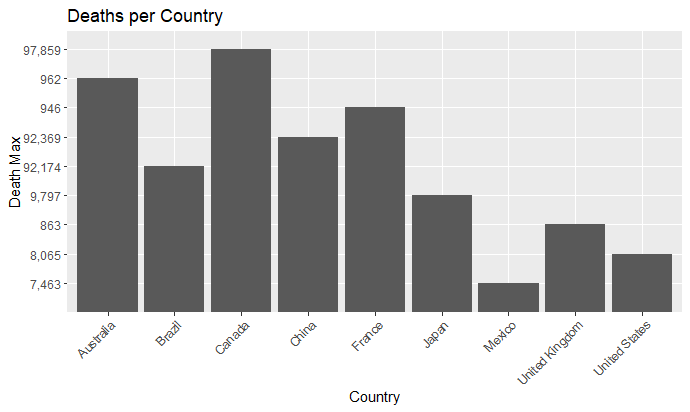
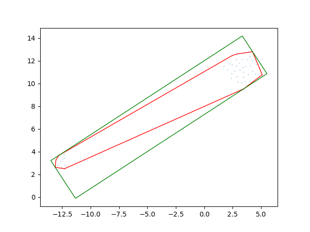

```{r setup, include=FALSE}
knitr::opts_chunk$set(echo = FALSE)
```


## Introduction

This purpose of this project is to look at, and interpret a data-set collected between 1970-2010 that looks specifically at Death rates per county in that time span using R. Futhermore, it will use that dataset to predict future death rates for each country.

## Background

This project emerged from research on the microbiomes of Mangroves in Southeast Asia. 


## Data

The data generated for this project was using an R package called CommunityAssemblR. In this project, it was used to generate matrices of microbial communities with antagonistic and stochastic processes at play. For each, it generates a resident community and then a donor difference matrix. The donor difference matrix illustrates the difference in the donor microbial community. This data had to be preprocessed as it was not spatially related.

To spatially arrange the data, a python package called DeepInsight was used. It employs dimensionality reduction techniques to produce images of the microbial community data. It goes through every row in an input matrix and produces an image representation of it. 




These Images were saved as NumPy arrays and loaded in R. The first step involving R in this project was the loading and pre-processing of the data. The packages used in R to develop this network are based on Python libraries so they are a little bit different to work with compared to your typical R package. 


The next couple of functions go through the two directories in the data_directory and process each file. On each file, they take the trial number, determine if it’s antagonistic or stochastic, get the resident input, donor output, sample number, and append it to a data frame. 

```{r Procces_data, echo=TRUE, message=FALSE}
process_array <- function(file1, file2){
  index_01 <- dim(file1)[1]
  index_02 <- dim(file2)[1]

  data <- list()
  if (index_01 == index_02){

    for (row in 1:index_01){

      resident_input <- file2[row,,,]
      donor_output <- file1[row,,,]
      output <- list(resident_input = resident_input, donor_output = donor_output, sample_num = row)
      data[[row]] <- output
    }

    return(data)

  } else {
    print("Files don't have the same number of samples.")
    return(NULL)
  }
}


results <- data.frame(trial_num = character(),
                      sample_num = integer(),
                      antag_stoch = integer(),
                      resident_input = I(list()),
                      donor_output = I(list()),
                      stringsAsFactors = FALSE)

data_in_files <- function(files, df) {
  index <- 0
  while (index < length(files)) {
    if (index %% 2 == 0) {
      file_01 <- files[index + 1]
      file_02 <- files[index + 2]


      # Extract trial number from file path
      trial_num <- gsub(".*trial-(\\d+).*", "\\1", file_01)

      #print(paste0("working on this trial ", trial_num))

      # Get antag or stoch from folder name
      folder <- basename(dirname(file_01))
      antag_stoch <- ifelse(folder == 'antagonism', 1,0)

      # Read input data 1
      input_data_1 <- np$load(file_01)

      # Read input data 2
      input_data_2 <- np$load(file_02)

      # Process data
      data <- process_array(input_data_1, input_data_2)

      # Process files
      for (d in data) {
        len_df <- nrow(df) + 1
        df[len_df, ] <- list(
          trial_num = trial_num,
          sample_num = d$sample_num,
          antag_stoch = antag_stoch,
          resident_input = list(array_reshape(d$resident_input, dim= c(1,224,224,3))),
          donor_output = list(array_reshape(d$donor_output, dim= c(1,224,224,3)))
        )
      }

    }
    index <- index + 2
  }
  return(df)
}


get_data <- function(data_directory,df){
  #get folders excluding the hidden ones
  subfolders <- list.dirs(data_directory, full.names = TRUE, recursive = FALSE)
  subfolders <- subfolders[!grepl("/\\.", subfolders)]

  df <- results

  for(folder in subfolders){

    #print(paste0("working on this folder", folder))

    #get folders excluding the hidden ones
    files_list <- list.files(folder, full.names = TRUE, recursive = FALSE)

    # Process files
    df <- data_in_files(files = files_list, df = df)
  }

  return(df)
}

data_directory <- "/Users/taylerfearn/Research/Zahn/build_CNN_communities/data/deepInsight"
all_results <- get_data(data_directory = data_directory)
```

The output of these functions is further processed with the following lines of code. They remove NA’s, shuffle the dataset, split it into training and testing. They also one-hot encode the antagonistic and stochastic labels and transform the data into matrices with the appropriate dimensions.

```{r preprocess dataset, echo=FALSE, message=FALSE}

```{r  train_graph,echo=FALSE, message=FALSE}
htmltools::includeHTML("./media/graph.html")
```

### On Testing Data

```{r testing_data, echo=FALSE, message=TRUE}
metrics <- c("accuracy", "f1_score", "loss", "precision", "recall")
values <- c(0.499, 0.666, 0.693, 0.499, 0.499)
df <- data.frame(metrics, values)

knitr::kable((df), "simple")

```


## Discussion

Overall, the model was able to predict the outcome 49% of the time on the training data. This indicates a large margin for improvement. Limitations of this porject include the training epochs which was set small compared to what is normally done. In addition to this the results were likely limited to due to optimizer selection and model architecture. Other architectures to try could be similar to GoogleNet or RESnet which have shown to be better preforming in some ways. In addition to this, the data could be prepared differently so as to be more evenly distributed amoung the various strengths of antagonism. My results don't indicate any overfiting however, that could change with the adjustment of epochs. In conclusion, my current model wasn't able to successfully preidct the outcome of microbial community processes, however, future iterations will look at adjust key parameters and architectures to deveplop a better predictive model.

Note: Training and working with neural networks is far less documented on R than on python. In addition to this, becuase it still uses python in the background it just ends up being slower than running a network in python. 


