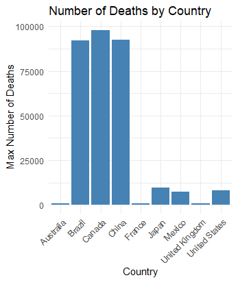
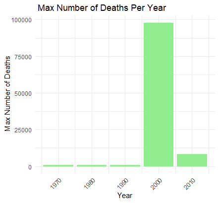
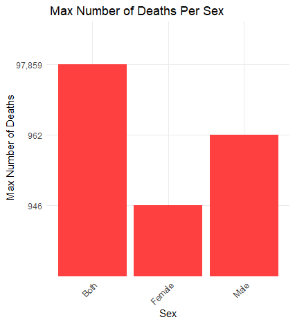
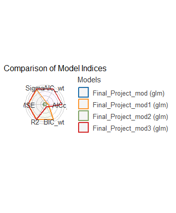

```{r setup, include=FALSE}
knitr::opts_chunk$set(echo = FALSE)
```


## Introduction

This purpose of this project is to look at, and interpret a data-set collected between 1970-2010 that looks specifically at Death rates per county in that time span using R. Furthermore, it will use that data set to predict future death rates for each country.

## Background

This data is taken from the Institute For Health Metrics and Evaluation. The data was collected to look at the Global Burden of Disease (GBD). This data was the largest and most complete study in order to determine the health loss across the world over time so health systems could be improved and effectively eliminate disparities. 


## Data

The data generated for this project was using R packages called Tidyverse and ggplot2. For this project, Tidyverse was used to clean up the data and make it easier to understand as well as be to able to present. ggplot2 was used for this project in order to generate plots that would accurately show the data and be able to interpret the data. For each of the graphs shown below the max number of deaths was calculated for specific countries across the world in order to show disparities between the countries. Additionally, the max number of deaths is shown between the time period of 1970-2010. Furthermore, A plot was generated to show the differences in the number of deaths between male and females in the designated time period. 


 





These Images were saved as PNG's and loaded in R markdown. The first step involving R in this project was the loading and pre-processing of the data.The following lines of code were used in a R project file in order to first look at, filter, clean, plot, and interpret the data. 

```{r Procces_data, echo=TRUE, message=FALSE}
suppressWarnings(library(tidyverse))
library(ggplot2)
library(knitr)


Final_Project_Data <- read.csv("C:/Users/Owner/Desktop/Biol 3100/OStuart0608.github.io/IHME_GBD_2010_MORTALITY_AGE_SPECIFIC_BY_COUNTRY_1970_2010 (1).csv")
view(Final_Project_Data)


suppressWarnings(Final_Project_Data1 <- Final_Project_Data %>%
  filter(Country.Name == c('Australia', 'Brazil', 'Central Africa', 'Canada', 'China', 'France', 'United Kingdom', 'Japan', 'Mexico', 'United States')) %>%
  select(-Country.Code) %>%
  view())


# Clean the Number.of.Deaths column (remove commas and convert to numeric)
Final_Project_Data2 <- aggregate(Number.of.Deaths ~ Country.Name, data = Final_Project_Data1, FUN = max)
view(Final_Project_Data2) 


sapply(Final_Project_Data2, class)

Final_Project_Data2$Number.of.Deaths <- as.numeric(gsub(",", "", Final_Project_Data2$Number.of.Deaths))

# Create a bar plot

ggplot(Final_Project_Data2, aes(x = Country.Name, y = Number.of.Deaths)) +
  geom_bar(stat = "identity", fill = "steelblue") +
  labs(title = "Number of Deaths by Country", x = "Country", y = " Max Number of Deaths") +
  theme_minimal() +
  theme(axis.text.x = element_text(angle = 45, hjust = 1))


## Code for 2nd plot on website


Final_Project_Data3 <- aggregate(Number.of.Deaths ~ Year, data = Final_Project_Data1, FUN = max)
view(Final_Project_Data3) 


sapply(Final_Project_Data3, class)

Final_Project_Data3$Number.of.Deaths <- as.numeric(gsub(",", "", Final_Project_Data3$Number.of.Deaths))

# Create a bar plot

ggplot(Final_Project_Data3, aes(x = Year, y = Number.of.Deaths)) +
  geom_bar(stat = "identity", fill = "lightgreen") +
  labs(title = " Max Number of Deaths Per Year", x = "Year", y = " Max Number of Deaths") +
  theme_minimal() +
  theme(axis.text.x = element_text(angle = 45, hjust = 1))


## Code for third graph on website

Final_Project_Data4 <- aggregate(Number.of.Deaths ~ Sex, data = Final_Project_Data1, FUN = max)
view(Final_Project_Data4) 


sapply(Final_Project_Data4, class)

Final_Project_Data4$Number.of.Deaths <- as.numeric(gsub(",", "", Final_Project_Data4$Number.of.Deaths))

# Create a bar plot

ggplot(Final_Project_Data4, aes(x = Sex, y = Number.of.Deaths)) +
  geom_bar(stat = "identity", fill = "brown1") +
  labs(title = " Max Number of Deaths Per Sex", x = "Sex", y = " Max Number of Deaths") +
  theme_minimal() +
  theme(axis.text.x = element_text(angle = 45, hjust = 1))

```

The output of these functions is further processed with the following lines of code. They show statistical models of the data to show what factors impacted the death rates most significantly, and generated predictions on those values. 

```{r preprocess dataset, echo=TRUE, message=FALSE}

Final_Project_Data <- read.csv("C:/Users/Owner/Desktop/Biol 3100/OStuart0608.github.io/IHME_GBD_2010_MORTALITY_AGE_SPECIFIC_BY_COUNTRY_1970_2010 (1).csv")
view(Final_Project_Data)


Final_Project_Data5 <- Final_Project_Data1 %>%
    mutate(Number.of.Deaths = as.numeric(gsub(",", "", Number.of.Deaths)),
           Death.Rate.Per.100.000 = as.numeric(gsub(",", "", Death.Rate.Per.100.000))) %>%
    view()

suppressWarnings(Final_Project_Data6 <- Final_Project_Data5 %>%
  filter(Country.Name == c('Australia', 'Brazil', 'Central Africa', 'Canada', 'China', 'France', 'United Kingdom', 'Japan', 'Mexico', 'United States')) %>%
  view())

## Creating comparison models
Final_Project_mod <- glm(data = Final_Project_Data6,
                  formula = Death.Rate.Per.100.000 ~ Country.Name + Year)
summary(Final_Project_mod)


Final_Project_mod1 <- glm(data = Final_Project_Data6,
                         formula = Death.Rate.Per.100.000 ~ Country.Name + Age.Group)
summary(Final_Project_mod1)


Final_Project_mod2 <- glm(data = Final_Project_Data6,
                          formula = Death.Rate.Per.100.000 ~ Country.Name  + Sex)
summary(Final_Project_mod2)


Final_Project_mod3 <- glm(data = Final_Project_Data6,
                          formula = Death.Rate.Per.100.000 ~ Country.Name  + Year + Age.Group + Sex)
summary(Final_Project_mod3)


## Generating table of statistical values
library(broom)

broom::tidy(Final_Project_mod3) 

```

### On Testing Models


```{r testing_data, echo=FALSE, message=FALSE, warning=FALSE}
library(modelr)
library(dplyr)
library(broom)
library(kableExtra)
library(easystats)
Final_Project_Predictions <- add_predictions(Final_Project_Data6, Final_Project_mod3)

view(Final_Project_Predictions)

 plot(Final_Project_Predictions$pred, 
          Final_Project_Predictions$Death.Rate.Per.100.000, 
          xlab = "Prediction", 
          ylab = "Death Rate Per 100,000")
  summary(Final_Project_Predictions)

```


## Discussion

Overall from the data, The highest Number of Deaths came from Canada in 2000 and the relative number of deaths between sexes was somewhat even. From the best model we were able to create and the prediction values the category that seemed to have the most impact was the Year. This makes sense from the data as we expect that as time goes on there is more available resources to help ease the Burden of Disease is countries across the world. Furthermore, From our prediction values it gave our graph an R squared value of 0.435 which indicates that our prediction values do not accurately predict the data for today values. 


