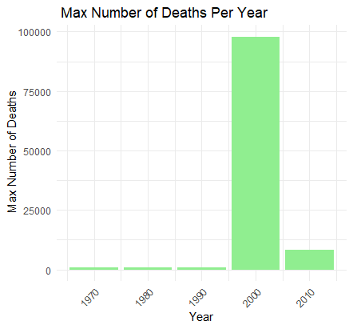
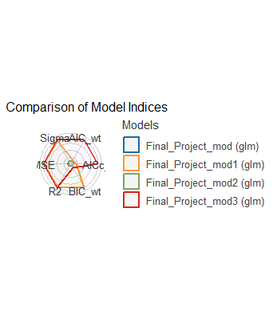

## Introduction

This purpose of this project is to look at, and interpret a data-set collected between 1970-2010 that looks specifically at Death rates per county in that time span using R. Furthermore, it will use that data set to predict future death rates for each country.

## Background

This data is taken from the Institute For Health Metrics and Evaluation. The data was collected to look at the Global Burden of Disease (GBD). This data was the largest and most complete study in order to determine the health loss across the world over time so health systems could be improved and effectively eliminate disparities. 


## Data

The data generated for this project was using R packages called Tidyverse and ggplot2. For this project, Tidyverse was used to clean up the data and make it easier to understand as well as be to able to present. ggplot2 was used for this project in order to generate plots that would accurately show the data and be able to interpret the data. For each of the graphs shown below the max number of deaths was calculated for specific countries across the world in order to show disparities between the countries. Additionally, the max number of deaths is shown between the time period of 1970-2010. Furthermore, A plot was generated to show the differences in the number of deaths between male and females in the designated time period. 


 





These Images were saved as PNG's and loaded in R markdown. The first step involving R in this project was the loading and pre-processing of the data.The following lines of code were used in a R project file in order to first look at, filter, clean, plot, and interpret the data. 


``` r
suppressWarnings(library(tidyverse))
library(ggplot2)
library(knitr)


Final_Project_Data <- read.csv("C:/Users/Owner/Desktop/Biol 3100/OStuart0608.github.io/IHME_GBD_2010_MORTALITY_AGE_SPECIFIC_BY_COUNTRY_1970_2010 (1).csv")
view(Final_Project_Data)


suppressWarnings(Final_Project_Data1 <- Final_Project_Data %>%
  filter(Country.Name == c('Australia', 'Brazil', 'Central Africa', 'Canada', 'China', 'France', 'United Kingdom', 'Japan', 'Mexico', 'United States')) %>%
  select(-Country.Code) %>%
  view())


# Clean the Number.of.Deaths column (remove commas and convert to numeric)
Final_Project_Data2 <- aggregate(Number.of.Deaths ~ Country.Name, data = Final_Project_Data1, FUN = max)
view(Final_Project_Data2) 


sapply(Final_Project_Data2, class)
```

```
##     Country.Name Number.of.Deaths 
##      "character"      "character"
```

``` r
Final_Project_Data2$Number.of.Deaths <- as.numeric(gsub(",", "", Final_Project_Data2$Number.of.Deaths))

# Create a bar plot

ggplot(Final_Project_Data2, aes(x = Country.Name, y = Number.of.Deaths)) +
  geom_bar(stat = "identity", fill = "steelblue") +
  labs(title = "Number of Deaths by Country", x = "Country", y = " Max Number of Deaths") +
  theme_minimal() +
  theme(axis.text.x = element_text(angle = 45, hjust = 1))
```

<!-- -->

``` r
## Code for 2nd plot on website


Final_Project_Data3 <- aggregate(Number.of.Deaths ~ Year, data = Final_Project_Data1, FUN = max)
view(Final_Project_Data3) 


sapply(Final_Project_Data3, class)
```

```
##             Year Number.of.Deaths 
##        "integer"      "character"
```

``` r
Final_Project_Data3$Number.of.Deaths <- as.numeric(gsub(",", "", Final_Project_Data3$Number.of.Deaths))

# Create a bar plot

ggplot(Final_Project_Data3, aes(x = Year, y = Number.of.Deaths)) +
  geom_bar(stat = "identity", fill = "lightgreen") +
  labs(title = " Max Number of Deaths Per Year", x = "Year", y = " Max Number of Deaths") +
  theme_minimal() +
  theme(axis.text.x = element_text(angle = 45, hjust = 1))
```

<!-- -->

``` r
## Code for third graph on website

Final_Project_Data4 <- aggregate(Number.of.Deaths ~ Sex, data = Final_Project_Data1, FUN = max)
view(Final_Project_Data4) 


sapply(Final_Project_Data4, class)
```

```
##              Sex Number.of.Deaths 
##      "character"      "character"
```

``` r
Final_Project_Data4$Number.of.Deaths <- as.numeric(gsub(",", "", Final_Project_Data4$Number.of.Deaths))

# Create a bar plot

ggplot(Final_Project_Data4, aes(x = Sex, y = Number.of.Deaths)) +
  geom_bar(stat = "identity", fill = "brown1") +
  labs(title = " Max Number of Deaths Per Sex", x = "Sex", y = " Max Number of Deaths") +
  theme_minimal() +
  theme(axis.text.x = element_text(angle = 45, hjust = 1))
```

<!-- -->

The output of these functions is further processed with the following lines of code. They show statistical models of the data to show what factors impacted the death rates most significantly, and generated predictions on those values. 


``` r
Final_Project_Data <- read.csv("C:/Users/Owner/Desktop/Biol 3100/OStuart0608.github.io/IHME_GBD_2010_MORTALITY_AGE_SPECIFIC_BY_COUNTRY_1970_2010 (1).csv")
view(Final_Project_Data)


Final_Project_Data5 <- Final_Project_Data1 %>%
    mutate(Number.of.Deaths = as.numeric(gsub(",", "", Number.of.Deaths)),
           Death.Rate.Per.100.000 = as.numeric(gsub(",", "", Death.Rate.Per.100.000))) %>%
    view()

suppressWarnings(Final_Project_Data6 <- Final_Project_Data5 %>%
  filter(Country.Name == c('Australia', 'Brazil', 'Central Africa', 'Canada', 'China', 'France', 'United Kingdom', 'Japan', 'Mexico', 'United States')) %>%
  view())

## Creating comparison models
Final_Project_mod <- glm(data = Final_Project_Data6,
                  formula = Death.Rate.Per.100.000 ~ Country.Name + Year)
summary(Final_Project_mod)
```

```
## 
## Call:
## glm(formula = Death.Rate.Per.100.000 ~ Country.Name + Year, data = Final_Project_Data6)
## 
## Deviance Residuals: 
##    Min      1Q  Median      3Q     Max  
## -19351   -4237    -838    3304   45086  
## 
## Coefficients:
##                            Estimate Std. Error t value Pr(>|t|)
## (Intercept)                496116.7   347101.2   1.429    0.168
## Country.NameBrazil         -14693.3    10210.1  -1.439    0.166
## Country.NameCanada         -15667.9     9391.2  -1.668    0.111
## Country.NameChina          -12699.5     9391.2  -1.352    0.191
## Country.NameFrance         -15344.4    10210.1  -1.503    0.149
## Country.NameJapan          -16133.0    10160.3  -1.588    0.128
## Country.NameMexico         -15987.0    10160.3  -1.573    0.131
## Country.NameUnited Kingdom -10989.0    10210.1  -1.076    0.295
## Country.NameUnited States   -8548.7    10210.1  -0.837    0.412
## Year                         -240.7      174.4  -1.380    0.183
## 
## (Dispersion parameter for gaussian family taken to be 176390471)
## 
##     Null deviance: 4760490453  on 29  degrees of freedom
## Residual deviance: 3527809412  on 20  degrees of freedom
## AIC: 664.62
## 
## Number of Fisher Scoring iterations: 2
```

``` r
Final_Project_mod1 <- glm(data = Final_Project_Data6,
                         formula = Death.Rate.Per.100.000 ~ Country.Name + Age.Group)
summary(Final_Project_mod1)
```

```
## 
## Call:
## glm(formula = Death.Rate.Per.100.000 ~ Country.Name + Age.Group, 
##     data = Final_Project_Data6)
## 
## Deviance Residuals: 
##        1         2         3         4         5         6         7         8  
##  12431.8  -12431.8       0.0       0.0       0.0      92.8     -92.8       0.0  
##        9        10        11        12        13        14        15        16  
##      0.0       0.0       0.0       0.0       0.0       0.0       0.0       0.0  
##       17        18        19        20        21        22        23        24  
##    -92.8      92.8       0.0       0.0       0.0    -886.3     886.3       0.0  
##       25        26        27        28        29        30  
##  -2517.9    -886.3    3404.1    3404.1  -12431.8    9027.6  
## 
## Coefficients:
##                            Estimate Std. Error t value Pr(>|t|)   
## (Intercept)                 54671.5    10277.2   5.320  0.00601 **
## Country.NameBrazil         -16700.4    23643.6  -0.706  0.51895   
## Country.NameCanada         -17168.7    28486.4  -0.603  0.57921   
## Country.NameChina          -40779.2    23203.6  -1.757  0.15367   
## Country.NameFrance         -17442.9    26519.4  -0.658  0.54663   
## Country.NameJapan          -17216.8    16446.7  -1.047  0.35427   
## Country.NameMexico         -15522.6    13713.4  -1.132  0.32092   
## Country.NameUnited Kingdom -41322.9    15807.7  -2.614  0.05916 . 
## Country.NameUnited States  -21466.6    11574.0  -1.855  0.13724   
## Age.Group1-4 years         -54640.9    15807.7  -3.457  0.02590 * 
## Age.Group10-14 years       -13850.3    24021.9  -0.577  0.59512   
## Age.Group15-19 years       -37471.4    30873.4  -1.214  0.29162   
## Age.Group25-29 years       -36480.3    13713.4  -2.660  0.05638 . 
## Age.Group28-364 days       -36909.9    25780.6  -1.432  0.22549   
## Age.Group30-34 years       -13286.2    16986.0  -0.782  0.47782   
## Age.Group35-39 years       -37061.2    29068.3  -1.275  0.27134   
## Age.Group40-44 years       -37335.8    20302.2  -1.839  0.13976   
## Age.Group45-49 years       -41980.1    11574.0  -3.627  0.02222 * 
## Age.Group50-54 years       -12926.1    16986.0  -0.761  0.48906   
## Age.Group55-59 years       -36947.4    25780.6  -1.433  0.22510   
## Age.Group60-64 years       -35507.4    30873.4  -1.150  0.31419   
## Age.Group65-69 years       -53246.8    15807.7  -3.368  0.02809 * 
## Age.Group7-27 days            677.4    24021.9   0.028  0.97885   
## Age.Group70-74 years       -11449.7    24021.9  -0.477  0.65849   
## Age.Group75-79 years       -33975.6    30873.4  -1.100  0.33290   
## Age.GroupAll ages          -37740.3    16446.7  -2.295  0.08342 . 
## ---
## Signif. codes:  0 '***' 0.001 '**' 0.01 '*' 0.05 '.' 0.1 ' ' 1
## 
## (Dispersion parameter for gaussian family taken to be 144262673)
## 
##     Null deviance: 4760490453  on 29  degrees of freedom
## Residual deviance:  577050692  on  4  degrees of freedom
## AIC: 642.3
## 
## Number of Fisher Scoring iterations: 2
```

``` r
Final_Project_mod2 <- glm(data = Final_Project_Data6,
                          formula = Death.Rate.Per.100.000 ~ Country.Name  + Sex)
summary(Final_Project_mod2)
```

```
## 
## Call:
## glm(formula = Death.Rate.Per.100.000 ~ Country.Name + Sex, data = Final_Project_Data6)
## 
## Deviance Residuals: 
##    Min      1Q  Median      3Q     Max  
## -18805   -4282     -97    2219   46874  
## 
## Coefficients:
##                            Estimate Std. Error t value Pr(>|t|)  
## (Intercept)                 14354.3     8051.3   1.783   0.0906 .
## Country.NameBrazil         -15289.5    10588.5  -1.444   0.1650  
## Country.NameCanada         -14199.1     9891.8  -1.435   0.1674  
## Country.NameChina          -11143.4     9891.8  -1.127   0.2740  
## Country.NameFrance         -15940.5    10588.5  -1.505   0.1487  
## Country.NameJapan          -15927.0    10588.5  -1.504   0.1490  
## Country.NameMexico         -15780.9    10588.5  -1.490   0.1525  
## Country.NameUnited Kingdom -11585.1    10588.5  -1.094   0.2876  
## Country.NameUnited States   -9144.8    10588.5  -0.864   0.3986  
## SexFemale                    -349.2     6256.1  -0.056   0.9561  
## SexMale                      5875.0     6256.1   0.939   0.3595  
## ---
## Signif. codes:  0 '***' 0.001 '**' 0.01 '*' 0.05 '.' 0.1 ' ' 1
## 
## (Dispersion parameter for gaussian family taken to be 190802445)
## 
##     Null deviance: 4760490453  on 29  degrees of freedom
## Residual deviance: 3625246450  on 19  degrees of freedom
## AIC: 667.44
## 
## Number of Fisher Scoring iterations: 2
```

``` r
Final_Project_mod3 <- glm(data = Final_Project_Data6,
                          formula = Death.Rate.Per.100.000 ~ Country.Name  + Year + Age.Group + Sex)
summary(Final_Project_mod3)
```

```
## 
## Call:
## glm(formula = Death.Rate.Per.100.000 ~ Country.Name + Year + 
##     Age.Group + Sex, data = Final_Project_Data6)
## 
## Deviance Residuals: 
##      1       2       3       4       5       6       7       8       9      10  
##  12235  -12235       0       0       0    1010   -1010       0       0       0  
##     11      12      13      14      15      16      17      18      19      20  
##      0       0       0       0       0       0   -1010    1010       0       0  
##     21      22      23      24      25      26      27      28      29      30  
##      0   -1607    1607       0   -1010   -1607    2618    2618  -12235    9618  
## 
## Coefficients: (2 not defined because of singularities)
##                            Estimate Std. Error t value Pr(>|t|)  
## (Intercept)                -7108819    3914023  -1.816   0.1669  
## Country.NameBrazil           -17159      27172  -0.631   0.5726  
## Country.NameCanada            90547      78641   1.151   0.3330  
## Country.NameChina            -40976      26601  -1.540   0.2211  
## Country.NameFrance           -17902      30459  -0.588   0.5980  
## Country.NameJapan           -126767      50589  -2.506   0.0873 .
## Country.NameMexico          -125466      51739  -2.425   0.0938 .
## Country.NameUnited Kingdom  -150611      65414  -2.302   0.1048  
## Country.NameUnited States   -130952      58177  -2.251   0.1098  
## Year                           3636       1988   1.829   0.1649  
## Age.Group1-4 years          -163929      65414  -2.506   0.0872 .
## Age.Group10-14 years        -122942      65697  -1.871   0.1580  
## Age.Group15-19 years        -252640     141942  -1.780   0.1731  
## Age.Group25-29 years          37231      29693   1.254   0.2987  
## Age.Group28-364 days        -144822      79828  -1.814   0.1673  
## Age.Group30-34 years          61277      42627   1.438   0.2461  
## Age.Group35-39 years         -73163      45712  -1.601   0.2078  
## Age.Group40-44 years         -73438      39006  -1.883   0.1563  
## Age.Group45-49 years         -76902      31369  -2.452   0.0916 .
## Age.Group50-54 years         -49290      27824  -1.771   0.1746  
## Age.Group55-59 years        -181223      98882  -1.833   0.1642  
## Age.Group60-64 years        -179783     100779  -1.784   0.1724  
## Age.Group65-69 years        -198899      84719  -2.348   0.1005  
## Age.Group7-27 days             2513      28796   0.087   0.9360  
## Age.Group70-74 years        -155070      87095  -1.780   0.1730  
## Age.Group75-79 years        -287343     158481  -1.813   0.1675  
## Age.GroupAll ages                NA         NA      NA       NA  
## SexFemale                     -1835       8465  -0.217   0.8423  
## SexMale                          NA         NA      NA       NA  
## ---
## Signif. codes:  0 '***' 0.001 '**' 0.01 '*' 0.05 '.' 0.1 ' ' 1
## 
## (Dispersion parameter for gaussian family taken to be 189383363)
## 
##     Null deviance: 4760490453  on 29  degrees of freedom
## Residual deviance:  568150090  on  3  degrees of freedom
## AIC: 643.84
## 
## Number of Fisher Scoring iterations: 2
```

``` r
## Generating table of statistical values
library(broom)

broom::tidy(Final_Project_mod3) 
```

```
## # A tibble: 29 × 5
##    term                        estimate std.error statistic p.value
##    <chr>                          <dbl>     <dbl>     <dbl>   <dbl>
##  1 (Intercept)                -7108819.  3914023.    -1.82   0.167 
##  2 Country.NameBrazil           -17159.    27172.    -0.631  0.573 
##  3 Country.NameCanada            90547.    78641.     1.15   0.333 
##  4 Country.NameChina            -40976.    26601.    -1.54   0.221 
##  5 Country.NameFrance           -17902.    30459.    -0.588  0.598 
##  6 Country.NameJapan           -126767.    50589.    -2.51   0.0873
##  7 Country.NameMexico          -125466.    51739.    -2.42   0.0938
##  8 Country.NameUnited Kingdom  -150611.    65414.    -2.30   0.105 
##  9 Country.NameUnited States   -130952.    58177.    -2.25   0.110 
## 10 Year                           3636.     1988.     1.83   0.165 
## # ℹ 19 more rows
```

### On Testing Models


<!-- -->

```
##  Country.Name            Year       Age.Group             Sex           
##  Length:30          Min.   :1970   Length:30          Length:30         
##  Class :character   1st Qu.:1980   Class :character   Class :character  
##  Mode  :character   Median :2000   Mode  :character   Mode  :character  
##                     Mean   :1993                                        
##                     3rd Qu.:2010                                        
##                     Max.   :2010                                        
##  Number.of.Deaths Death.Rate.Per.100.000      pred        
##  Min.   :   306   Min.   :   30.6        Min.   :-9365.0  
##  1st Qu.:  2412   1st Qu.:  154.9        1st Qu.:   47.1  
##  Median :  8674   Median :  547.7        Median :  800.8  
##  Mean   : 66713   Mean   : 4450.5        Mean   : 4450.5  
##  3rd Qu.: 28206   3rd Qu.: 1357.0        3rd Qu.: 2096.1  
##  Max.   :440804   Max.   :67103.3        Max.   :54868.2
```


## Discussion

Overall from the data, The highest Number of Deaths came from Canada in 2000 and the relative number of deaths between sexes was somewhat even. From the best model we were able to create and the prediction values the category that seemed to have the most impact was the Year. This makes sense from the data as we expect that as time goes on there is more available resources to help ease the Burden of Disease is countries across the world. Furthermore, From our prediction values it gave our graph an R squared value of 0.435 which indicates that our prediction values do not accurately predict the data for today values. 


